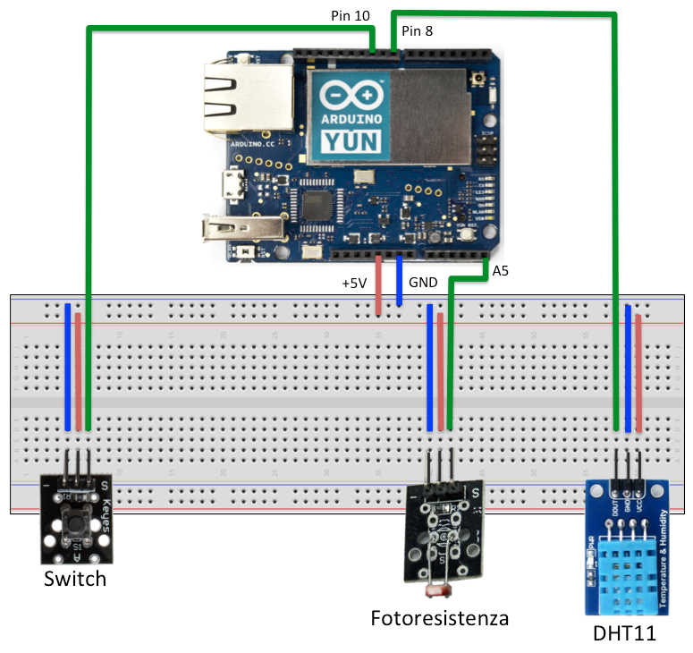

Aruino YUN demo for YUCCA
=========================
This folder contains a first version of  Arduino YUN Demo application for YUCCA. That implement a sensor of temperature, luminosity and humidity.

For build the sensor use this schema:

In this folder:

* **HTTP-DEMO**: sensor send data to YUCCA using HTTP CURL command
* **MOSQUITTO-DEMO**: sensor send data to YUCCA using YUN mosquitto client
* **MQTT-DEMO**: sensor send data to YUCCA using MQTT and PubSub client library for YUN
* **libraries**: contain DHT11 and PubSub original libraries
* **Web Client Demo**: contain a client for visualizing sensor data after YUCCA elaboration

